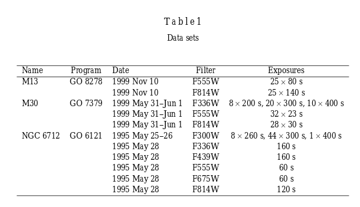

# 2019.08.20

I started to write the information regarding the X-ray sources in different Globular Clusters, but Dr. Maccarone suggested to try to focus on some specific sourddes on narrow field mode. Have to ask Liliana on her AM CVns candidates in globular clusters and also look at the qLMXB on Globlular clusters. Maybe with the absroption line of the companion, if known, can get a radial velocity curve. There are some eclipsing LMXB on the cluster. If we know they are eclipsing then we know the inclination. Resolution of AO in MUSE is about 0.3".

Also we discussed the project I will work on with XMM-Newton data for AR Scorpi. He send me the proposal to my email. Also he put a poor wheater Gemini proposal to look for broad emission line. Broad meaning 400-500 km/s. With the XMM Newton data have to learn how to carefully characterize variability and spectral feautures. The spectrum should have some plasma emission lines, and we will see how flat it looks. It also apparently looked flat in the radio data. This ARSCOpi is radio white dwarf, pulsar.

Regarding the Hubble survey of cluster M30 has a lot of Hubble data that was taken to study binaries. In 2004 Pietrukowicz and Kaluzny analyzed data from wfpc for M13, M30 and NGC 6712. [Variable Stars in the Archival HST Data of Globular Clusters M13, M30 and NGC 6712](https://arxiv.org/abs/astro-ph/0403716)

This proposal [7379](https://archive.stsci.edu/proposal_search.php?mission=hst&id=7379) by Edmonds with WFPC23 in the filters F336Q, F55W and F814W  was to 'make a detailed study of binaries'

 
# 2019.08.21

Started to identify particular intersting target for MUSE follow up.i $$ 5+5 $$
