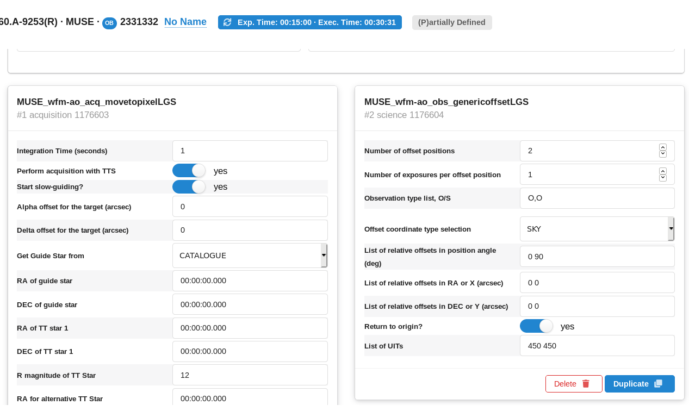

# 2019.09.13

With the HST data of NGC6397 again. It is in krieger.

# 2019.09.16

For one is 29:11 = 1751 , for two 1831 secons and for 3 1911 seconds. From 2 to 3 is 80 seconds and from 1 to 2 80. 
 think that this is the readout of 60 s plus the 0.11 s per degree 0.1x90=9.9

## The flux for the line

Mv = 3.7 and for the Sun is Mv=4.8 so L source A = 2.75 Lsun but at a distance of 9 kpc.

Here I checked the absolute magnitude of the Sun in several filters:

http://mips.as.arizona.edu/~cnaw/sun.html

2.75 the luminosity of the Sun us 1.058x10^27 Watts at a distance of 9 kpc this iss:

$$1.092×10^{-12}$$ ergs per square centimeter second

# 2019.09.17

Two Obs and request a wavier of 1 hour and 15 minutes and get all the frames qe think we can get. 

$$5+5 \sim 5$$

