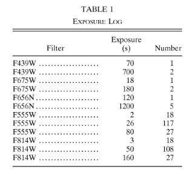
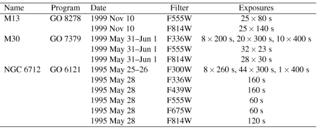

# 2020.02.03 #HSTGC 

## NGC 6121 (M4)

This cluster is mentioned in the Bonanos HST catalog of variables HCV. The proposal 12911 has a lot of datato try tro find binaries between 0.5 months and 15 years. The PI is Luigi Bedin. There is a paper in 2014 by Nascimbeni, V from the [M4 Core Project with HST](https://ui.adsabs.harvard.edu/abs/2014MNRAS.442.2381N/abstract) that search for variable in the primary field. aprox 24 d cadence, They did it with 589 (392-396s) F467M images

|     | Target Name      | Filters/Gratings   | Instrument   |   Exp Time |   Proposal ID |   ocurrence |
|----:|:-----------------|:-------------------|:-------------|-----------:|--------------:|------------:|
|  77 | M-4              | F775W              | WFC3         |     20     |         12911 |          97 |
|  75 | M-4              | F467M              | WFC3         |   1960     |         12911 |          97 |
|  45 | DARK             | MIRVIS             | STIS         |     60     |         13131 |          26 |
|  10 | BIAS             | MIRVIS             | STIS         |      0     |         13133 |          22 |
|  87 | M4-CORE          | F555W              | WFPC2        |   1000     |          5461 |          15 |
|  82 | M4-1-CORE-RADIUS | F555W              | WFPC2        |   1000     |          5461 |          15 |
|  76 | M-4              | F467M              | WFC3         |   2000     |         12911 |          12 |
|  34 | DARK             | MIRVIS             | STIS         |   1100     |         13131 |          12 |
|  74 | M-4              | F467M              | WFC3         |   1568     |         12911 |          11 |
|  78 | M-4              | F775W              | WFC3         |    386     |         12911 |          11 |
|   4 | BIAS             | F502N;F660N        | ACS          |      0     |         13154 |           9 |
|  91 | M4-CTR           | F814W              | WFPC2        |    700     |          8153 |           8 |
|  44 | DARK             | MIRVIS             | STIS         |     60     |         12742 |           8 |
|  43 | DARK             | MIRVIS             | STIS         |     60     |         12741 |           8 |
|  93 | M4-NEAR          | F814W              | WFPC2        |    700     |          8153 |           8 |
|  84 | M4-1-CORE-RADIUS | F814W              | WFPC2        |    700     |          5461 |           7 |
|  86 | M4-CORE          | F336W              | WFPC2        |   1500     |          5461 |           7 |

# NGC 6397

|     | Target Name                  | Filters/Gratings            | Instrument   |   Exp Time |   Proposal ID |   ocurrence |
|----:|:-----------------------------|:----------------------------|:-------------|-----------:|--------------:|------------:|
|   8 | ANY                          | F814W                       | WFPC2        |    600     |         10424 |         126 |
|   4 | ANY                          | F336W                       | WFPC2        |    700     |         10424 |         102 |
|   7 | ANY                          | F606W                       | WFPC2        |    600     |         10424 |         101 |
| 121 | NGC6397                      | F675W                       | WFPC2        |     40     |          7335 |          38 |
|  87 | NGC6397                      | F336W                       | WFPC2        |    400     |          5929 |          28 |
|   6 | ANY                          | F606W                       | WFPC2        |    500     |         10424 |          25 |
| 108 | NGC6397                      | F555W                       | WFPC2        |     40     |          7335 |          24 |
| 126 | NGC6397                      | F814W                       | WFPC2        |     40     |          7335 |          24 |
| 116 | NGC6397                      | F656N                       | WFPC2        |    800     |          7335 |          18 |
|  95 | NGC6397                      | F439W                       | WFPC2        |    400     |          5929 |          16 |
|   3 | ANY                          | F336W                       | WFPC2        |    600     |         10424 |          13 |
|   0 | ANY                          | F225W                       | WFC3         |   1360     |         11633 |          12 |
|   2 | ANY                          | F336W                       | WFPC2        |    500     |         10424 |          11 |
| 115 | NGC6397                      | F656N                       | WFPC2        |    700     |          7335 |           7 |
| 187 | NGC6397-POS3                 | F656N                       | WFPC         |   1000     |          3851 |           6 |
|  88 | NGC6397                      | F336W                       | WFPC2        |    500     |          5929 |           6 |
| 107 | NGC6397                      | F555W                       | WFPC2        |     40     |          5929 |           6 |
| 181 | NGC6397-POS1                 | F656N                       | WFPC         |   1000     |          3851 |           6 |
| 184 | NGC6397-POS2                 | F656N                       | WFPC         |   1000     |          3851 |           6 |
|  81 | NGC6397                      | F220W;CLEAR2                | FOC          |    597.625 |          3144 |           5 |
|  10 | BIAS                         | F502N;F660N                 | ACS          |      0     |         10367 |           5 |
|  69 | NGC6397                      | CLEAR1L;F435W               | ACS          |    353     |         10257 |           5 |
| 112 | NGC6397                      | F625W;CLEAR2L               | ACS          |    350     |         10257 |           5 |

## NGC 6544

Few points. Only 12 in 2013, 8 in 2005 and 5 in 2000.

|    | Target Name   | Filters/Gratings   | Instrument   |   Exp Time |   Proposal ID |   ocurrence |
|---:|:--------------|:-------------------|:-------------|-----------:|--------------:|------------:|
| 20 | NGC6544       | F606W              | WFC3         |     400    |         12932 |           5 |
| 15 | NGC6544       | F390W              | WFC3         |    2102    |         12932 |           4 |
| 19 | NGC6544       | F555W              | WFPC2        |      30    |          8118 |           2 |
|  4 | DARK          | F390W              | WFC3         |    1800    |         13076 |           2 |
|  7 | NGC-6544      | CLEAR1L;F435W      | ACS          |     680    |         10349 |           2 |

## NGC 6656 (M22)

There is a proposal [7615](https://archive.stsci.edu/proposal_search.php?mission=hst&id=7615) to do gravitational microlensing by Sahu. There are 41 observations in 3 fields near the core  at 3 day intervals.  In 2003 Pietrukowicz and Kaluzny did a search for variable stars in the central part of M22. [Paper](https://ui.adsabs.harvard.edu/abs/2003AcA....53..371P/abstract). They searched in the F814W in one region. In F606W tehre are only 72i ein all fields and 24 in each field 

|    | Target Name                | Filters/Gratings           | Instrument   |   Exp Time |   Proposal ID |   ocurrence |
|---:|:---------------------------|:---------------------------|:-------------|-----------:|--------------:|------------:|
| 70 | NGC6656                    | F814W                      | WFPC2        |    260     |          7615 |         192 |
| 60 | NGC6656                    | F606W                      | WFPC2        |    260     |          7615 |          72 |
| 58 | NGC6656                    | F555W                      | WFPC2        |     26     |          8174 |          12 |
| 69 | NGC6656                    | F785LP                     | WFPC2        |     26     |          8174 |          11 |
| 42 | M22-WFPC2                  | F814W                      | WFPC2        |    100     |         11233 |           9 |
|  1 | BIAS                       | MIRVIS                     | STIS         |      0     |          7949 |           9 |
| 41 | M22-WFPC2                  | F450W                      | WFPC2        |    350     |         11233 |           9 |
| 14 | EARTH-CALIB                | F343N                      | WFPC2        |     14     |          8053 |           8 |
| 16 | EARTH-CALIB                | F390N                      | WFPC2        |      1.6   |          8053 |           8 |
| 17 | EARTH-CALIB                | F437N                      | WFPC2        |      2     |          8053 |           8 |
| 11 | DARK                       | MIRVIS                     | STIS         |    960     |          7949 |           6 |
|  4 | DARK                       | F1042M;F437N               | WFPC2        |   1000     |          7713 |           5 |

# NGC 6366 

There are 3 deep 1426 sconds exposure in F275W, in F336W and D438W.

|    | Target Name   | Filters/Gratings   | Instrument   |   Exp Time |   Proposal ID |   ocurrence |
|---:|:--------------|:-------------------|:-------------|-----------:|--------------:|------------:|
|  0 | DARK          | F275W              | WFC3         |        900 |         14005 |           3 |
|  4 | NGC-6366      | F336W              | WFC3         |        610 |         13297 |           3 |
|  5 | NGC-6366      | F438W              | WFC3         |         62 |         13297 |           3 |
|  2 | NGC-6366      | F275W              | WFC3         |       1426 |         13297 |           2 |
|  1 | DARK          | F350LP             | WFC3         |        900 |         14005 |           1 |
|  3 | NGC-6366      | F275W              | WFC3         |       1590 |         13297 |           1 |
|  6 | NGC6366       | CLEAR1L;F814W      | ACS          |        570 |         10775 |           1 |
|  7 | NGC6366       | F606W;CLEAR2L      | ACS          |        570 |         10775 |           1 |

# NGC 6752

There is a Proposal [5318](https://archive.stsci.edu/proposal_search.php?mission=hst&id=5318) that was to search for binaries with 396 WFPC2 images. 

Last time observed was in 1999. In this [paper](https://ui.adsabs.harvard.edu/abs/1996ApJ...473L..31B/abstract) by Bailyn in 1996 they report the period of 2 CVs of 5.1 and 3.7 hours. 

|     | Target Name         | Filters/Gratings   | Instrument   |   Exp Time |   Proposal ID |   ocurrence |
|----:|:--------------------|:-------------------|:-------------|-----------:|--------------:|------------:|
|  66 | NGC6752             | F220W;CLEAR2       | FOC          |    596.875 |          2472 |          23 |
| 254 | NGC6752-POS9        | F555W              | WFPC2        |     26     |          5318 |          14 |
| 224 | NGC6752-POS4        | F555W              | WFPC2        |     26     |          5318 |          13 |
| 230 | NGC6752-POS5        | F555W              | WFPC2        |     26     |          5318 |          13 |
| 193 | NGC6752-POS2        | F555W              | WFPC2        |     26     |          5318 |          13 |
| 242 | NGC6752-POS7        | F555W              | WFPC2        |     26     |          5318 |          13 |
|  88 | NGC6752             | F555W              | WFPC2        |     26     |          7469 |          13 |
| 236 | NGC6752-POS6        | F555W              | WFPC2        |     26     |          5318 |          13 |
| 248 | NGC6752-POS8        | F555W              | WFPC2        |     26     |          5318 |          13 |
| 181 | NGC6752-POS1        | F555W              | WFPC2        |     26     |          5318 |          13 |
| 217 | NGC6752-POS3        | F555W              | WFPC2        |     26     |          5318 |          13 |
| 258 | NGC6752-POS9        | F814W              | WFPC2        |     50     |          5318 |          13 |
| 228 | NGC6752-POS4        | F814W              | WFPC2        |     50     |          5318 |          12 |
| 234 | NGC6752-POS5        | F814W              | WFPC2        |     50     |          5318 |          12 |
| 124 | NGC6752             | MIRVIS             | STIS         |    400     |          9621 |          12 |
| 198 | NGC6752-POS2        | F814W              | WFPC2        |     50     |          5318 |          12 |
| 128 | NGC6752             | MIRVIS             | STIS         |    990     |          9621 |          12 |
|  71 | NGC6752             | F336W              | WFPC2        |   2200     |          5439 |          12 |
| 252 | NGC6752-POS8        | F814W              | WFPC2        |     50     |          5318 |          12 |
| 246 | NGC6752-POS7        | F814W              | WFPC2        |     50     |          5318 |          12 |
| 190 | NGC6752-POS1        | F814W              | WFPC2        |     50     |          5318 |          12 |
| 240 | NGC6752-POS6        | F814W              | WFPC2        |     50     |          5318 |          12 |
| 103 | NGC6752             | F785LP             | WFPC2        |     26     |          7469 |          12 |
| 222 | NGC6752-POS3        | F814W              | WFPC2        |     50     |          5318 |          12 |
|  68 | NGC6752             | F336W              | WFPC         |   1000     |          4084 |           8 |
| 120 | NGC6752             | MIRVIS             | STIS         |    200     |          9621 |           8 |
| 117 | NGC6752             | MIRVIS             | STIS         |    180     |          9621 |           8 |
| 105 | NGC6752             | F814W              | WFPC2        |   1000     |          5439 |           7 |

# NGC 6838

There are 33 timages in total in various fiulters and dates. 

|    | Target Name   | Filters/Gratings   | Instrument   |   Exp Time |   Proposal ID |   ocurrence |
|---:|:--------------|:-------------------|:-------------|-----------:|--------------:|------------:|
|  0 | BIAS          | F255W              | WFPC2        |       0    |         11793 |           4 |
|  2 | BIAS          | F555W              | WFPC2        |       0    |         11793 |           4 |
|  8 | DARK          | MIRVIS             | STIS         |      60    |          8437 |           4 |
| 31 | NGC6838-M71   | F555W              | WFPC2        |      10    |         11975 |           3 |
| 29 | NGC6838-M71   | F336W              | WFPC2        |     350    |         11975 |           3 |
| 13 | NGC-6838-M-71 | F336W              | WFC3         |     606    |         13297 |           2 |
| 33 | TUNGSTEN      | F475X              | WFC3         |       1    |         13072 |           2 |
| 27 | NGC6838-M71   | F255W              | WFPC2        |     700    |         11975 |           2 |
| 23 | NGC6838       | F555W              | WFPC2        |      40    |         10524 |           2 |
| 22 | NGC6838       | F555W              | WFPC2        |      30    |          8118 |           2 |
| 19 | NGC6838       | F439W              | WFPC2        |     100    |          8118 |           2 |
| 18 | NGC6838       | F336W              | WFPC2        |     400    |         10524 |           2 |
| 14 | NGC-6838-M-71 | F438W              | WFC3         |      65    |         13297 |           2 |
| 17 | NGC6838       | F255W              | WFPC2        |     500    |         10524 |           2 |
|  4 | BIAS          | MIRVIS             | STIS         |       0    |         13151 |           2 |
| 10 | INTFLAT       | F555W              | WFPC2        |      20    |         11793 |           2 |
|  9 | INTFLAT       | F555W              | WFPC2        |      10    |         11793 |           2 |
| 12 | NGC-6838-M-71 | F275W              | WFC3         |    1584    |         13297 |           1 |
| 26 | NGC6838-M71   | F255W              | WFPC2        |       0.5  |         11975 |           1 |
|  3 | BIAS          | F631N              | WFC3         |       0    |         13076 |           1 |
| 32 | TUNGSTEN      | F343N              | WFC3         |       0.48 |         13076 |           1 |
| 30 | NGC6838-M71   | F555W              | WFPC2        |       0.5  |         11975 |           1 |
|  5 | DARK          | F1042M;F437N       | WFPC2        |    1800    |         11302 |           1 |
| 28 | NGC6838-M71   | F336W              | WFPC2        |      12    |         11975 |           1 |
|  6 | DARK          | F343N              | WFC3         |     900    |         13076 |           1 |
| 24 | NGC6838       | F606W;CLEAR2L      | ACS          |     304    |         10775 |           1 |
| 25 | NGC6838       | F606W;CLEAR2L      | ACS          |    4816.51 |         12932 |           1 |
| 15 | NGC6838       | CLEAR1L;F814W      | ACS          |    3196.51 |         12932 |           1 |
|  7 | DARK          | MIRVIS             | STIS         |    1100    |          8437 |           1 |
| 21 | NGC6838       | F555W              | WFPC2        |       3    |          8118 |           1 |
| 20 | NGC6838       | F439W              | WFPC2        |      40    |          8118 |           1 |
| 11 | NGC-6838-M-71 | F275W              | WFC3         |    1500    |         13297 |           1 |
|  1 | BIAS          | F343N              | WFC3         |       0    |         13076 |           1 |
| 16 | NGC6838       | CLEAR1L;F814W      | ACS          |     324    |         10775 |           1 |
| 34 | TUNGSTEN      | F475X              | WFC3         |     200    |         13072 |           1 |

# NGC 6254

There are 60 in total 

# NGC 6218

20 with WFPC2 in 2000 and some other scatter.  

# NGC 3201

There are 6 in 2000, and some scatters.

# NGC 5139 (Omega Cen)

There is a proposal [6821](https://archive.stsci.edu/proposal_search.php?mission=hst&id=6821). There were also two calibration missions in F336W in 2012 and 2011 with some very short exposure times of 350 s and 10s.

|     | Target Name            | Filters/Gratings            | Instrument   |   Exp Time |   Proposal ID |   ocurrence |
|----:|:-----------------------|:----------------------------|:-------------|-----------:|--------------:|------------:|
|  40 | DARK                   | BLANK                       | WFC3         |    352.94  |         14015 |         118 |
|  39 | DARK                   | BLANK                       | WFC3         |    352.94  |         13572 |          67 |
|  38 | DARK                   | BLANK                       | WFC3         |    352.935 |         14381 |          62 |
|  41 | DARK                   | BLANK                       | WFC3         |    352.94  |         14381 |          56 |
| 280 | OMEGACEN               | F139M                       | WFC3         |    502.936 |         11928 |          27 |
| 286 | OMEGACEN               | F160W                       | WFC3         |    252.937 |         11928 |          27 |
| 273 | OMEGACEN               | F098M                       | WFC3         |    352.94  |         11928 |          27 |
| 276 | OMEGACEN               | F110W                       | WFC3         |    227.937 |         11928 |          27 |
| 278 | OMEGACEN               | F125W                       | WFC3         |    277.938 |         11928 |          27 |
|  20 | BIAS                   | MIRVIS                      | STIS         |      0     |         11847 |          25 |
| 397 | OMEGACEN               | F814W                       | WFC3         |     40     |         11911 |          24 |
| 356 | OMEGACEN               | F606W                       | WFC3         |     40     |         11911 |          24 |
| 331 | OMEGACEN               | F438W                       | WFC3         |    350     |         11911 |          22 |
| 363 | OMEGACEN               | F606W                       | WFC3         |     40     |         14393 |          19 |
| 362 | OMEGACEN               | F606W                       | WFC3         |     40     |         14031 |          19 |
| 302 | OMEGACEN               | F275W                       | WFC3         |    800     |         11911 |          19 |
| 310 | OMEGACEN               | F336W                       | WFC3         |    350     |         11911 |          17 |
| 352 | OMEGACEN               | F555W                       | WFC3         |     40     |         11911 |          16 |
| 300 | OMEGACEN               | F225W                       | WFC3         |    900     |         11911 |          16 |
| 402 | OMEGACEN               | F850LP                      | WFC3         |     60     |         11911 |          16 |
| 288 | OMEGACEN               | F160W                       | WFC3         |    252.937 |         12353 |          15 |
| 396 | OMEGACEN               | F775W                       | WFC3         |    350     |         11911 |          14 |
| 323 | OMEGACEN               | F390W                       | WFC3         |    350     |         11911 |          14 |
| 358 | OMEGACEN               | F606W                       | WFC3         |     40     |         12353 |          13 |
| 111 | DARK                   | MIRVIS                      | STIS         |     60     |         12741 |          13 |
| 173 | NGC5139                | F450W                       | WFPC2        |    100     |          8655 |          12 |

# NGC 6540 

Only observed 8 times total 

# NGC 6809

Only observed in F336W 12 times years appart. 

# NGC 6626

In F336W observed 4 times in 2009. In F55W observed in 1997 11 times. 

# NGC 6352 

In F555W there are 23 and 23 in F814W. 

# NGC 4372

Only 11 total

# NGC 6304

6 F436W

# NGC 6553

10 F555W fexposres in 1998. 10 F814W.

# NGC 6171

15 F336W in 1997

# NGC 4833

In F333W there are 5 in 2001.

# NGC 6266

In F555W there are 20 in 2008. 

# NGC 6712

There are 53 in F300W in 1995 with WFPC2 wiuth 300 s exposure times.

The PI was Philip Charles [6121](https://archive.stsci.edu/proposal_search.php?mission=hst&id=6121). They found a Periodic IV modulation of a double degenerate binary in this cluster. [paper](https://ui.adsabs.harvard.edu/abs/1996MNRAS.282L..37H/abstract). They did aperture photometry. 

Fpr this cluster here is the table from this [paper](https://ui.adsabs.harvard.edu/abs/2004AcA....54...19P/abstract).

|    | Target Name    | Filters/Gratings   | Instrument   |   Exp Time |   Proposal ID |   ocurrence |
|---:|:---------------|:-------------------|:-------------|-----------:|--------------:|------------:|
|  6 | NGC6712        | F300W              | WFPC2        |    300     |          6121 |          44 |
|  5 | NGC6712        | F300W              | WFPC2        |    260     |          6121 |           8 |
| 23 | NGC6712-STAR   | G650L              | FOS          |   2249.98  |          4791 |           2 |
| 21 | NGC6712-STAR   | G160L              | FOS          |   2309.98  |          5127 |           2 |
| 13 | NGC6712        | F555W              | WFPC2        |     60     |          6121 |           1 |
| 22 | NGC6712-STAR   | G160L              | FOS          |    380     |          5127 |           1 |
| 20 | NGC6712-STAR   | G160L              | FOS          |   1099.98  |          5127 |           1 |

# NGC 6205 (M13

There is a Bailyn Proposal [8278](https://archive.stsci.edu/proposal_search.php?mission=hst&id=8278).

They wanted to do binary population. Pietrukowicz and Kalyzny in 2004 trie dto do variable from the archive. This is the dataset from this [paper](https://ui.adsabs.harvard.edu/abs/2004AcA....54...19P/abstract) table. 

They detected 4 new variable.s In F555W tje are 12 newer data from 2000

# NGC 6717

There are data scatter 23 total in different filter. 

#NGC 6558

Not much data
ACS thare are 4 and two propietart

# NGC 6760

There are3 F439W data from 2001.

# NGC 5904 (M5)

In this paper [Stellar Populations and Variable Stars in the Core of the Globular Cluster M5](https://ui.adsabs.harvard.edu/abs/1998AJ....115..725D/abstract). Theys used 22 F336W exposures from 1993. They found 29 variables. 

Thera re newer F555W data in 2008. 4x400,6x100 and 14x10 seconds. 

|    | Filters/Gratings   | Instrument   |   Exp Time |   Proposal ID |   ocurrence |
|---:|:-------------------|:-------------|-----------:|--------------:|------------:|
| 19 | F555W              | WFPC2        |         10 |         11077 |          14 |
| 20 | F555W              | WFPC2        |        100 |         11077 |           6 |
|  4 | CLEAR1L;F435W      | ACS          |        680 |         10615 |           5 |
| 36 | F814W              | WFC3         |        700 |         12517 |           4 |
| 25 | F555W              | WFPC2        |        400 |         11077 |           4 |
| 27 | F606W              | WFC3         |        700 |         12517 |           4 |
| 14 | F390W              | WFC3         |        735 |         12517 |           4 |
| 23 | F555W              | WFPC2        |         30 |          6607 |           3 |
|  1 | CLEAR1L;F435W      | ACS          |       1235 |         10615 |           3 |
| 12 | F336W              | WFPC2        |        400 |          6607 |           3 |
|  8 | F255W              | WFPC2        |       1300 |          6607 |           3 |
| 11 | F336W              | WFC3         |        612 |         13297 |           2 |
|  7 | F160BW             | WFPC2        |        500 |          6607 |           2 |
| 17 | F439W              | WFPC2        |        100 |          8118 |           2 |
| 21 | F555W              | WFPC2        |          3 |          6607 |           2 |
| 24 | F555W              | WFPC2        |         30 |          8118 |           2 |
| 30 | F656N              | WFC3         |       5250 |         11615 |           1 |
| 31 | F656N              | WFPC2        |        200 |          5865 |           1 |
| 29 | F625W;CLEAR2L      | ACS          |        300 |         10120 |           1 |
| 28 | F606W;CLEAR2L      | ACS          |        567 |         10775 |           1 |
| 32 | F656N              | WFPC2        |        300 |          5865 |           1 |
| 33 | F658N;CLEAR2L      | ACS          |       1080 |         10120 |           1 |
| 34 | F658N;CLEAR2L      | ACS          |        680 |         10120 |           1 |
| 26 | F606W              | WFC3         |        600 |         11615 |           1 |
| 35 | F814W              | WFC3         |        600 |         11615 |           1 |
|  0 | CLEAR1L;F435W      | ACS          |       1150 |         10615 |           1 |
| 22 | F555W              | WFPC2        |          3 |          8118 |           1 |
| 16 | F438W              | WFC3         |         59 |         13297 |           1 |
| 15 | F438W              | WFC3         |         58 |         13297 |           1 |
| 13 | F390W              | WFC3         |       3000 |         11615 |           1 |
| 10 | F275W              | WFC3         |       1380 |         13297 |           1 |
|  9 | F275W              | WFC3         |       1378 |         13297 |           1 |
|  6 | CLEAR1L;F814W      | ACS          |        567 |         10775 |           1 |
|  5 | CLEAR1L;F435W      | ACS          |         70 |         10120 |           1 |
|  3 | CLEAR1L;F435W      | ACS          |        680 |         10120 |           1 |
|  2 | CLEAR1L;F435W      | ACS          |       1260 |         10615 |           1 |
| 18 | F439W              | WFPC2        |         40 |          8118 |           1 |

# NGC 6541

In 1994 there are 14xF555W. They used thid ata to discovery an erupting Dwarf Nova in NGC 6624. [By Shara](https://ui.adsabs.harvard.edu/abs/1996ApJ...473L..35S/abstract)

Here is that table fo data:

# 2020.02.04

There is an interesting paper on the close binaries on Apogee. By Price-Whelan and called [Close Binary Companions to APOGEE DR16 Stars](https://arxiv.org/abs/2002.00014).

# 2020.02.06

ASASSN-14-e1

095.D-0888(G)

http://www.astronomy.ohio-state.edu/~assassin/followup/asassn14ei_lc.png

://www.aavso.org/vsx/index.php?view=detail.top&revid=300534//www.aavso.org/vsx/index.php?view=detail.top&revid=300534
